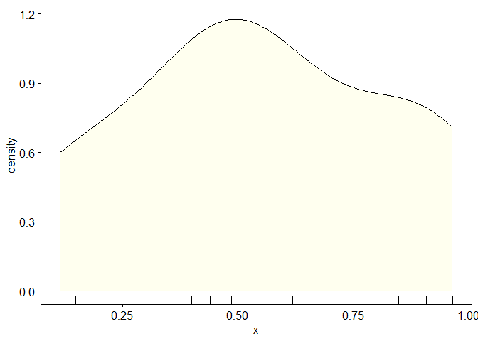
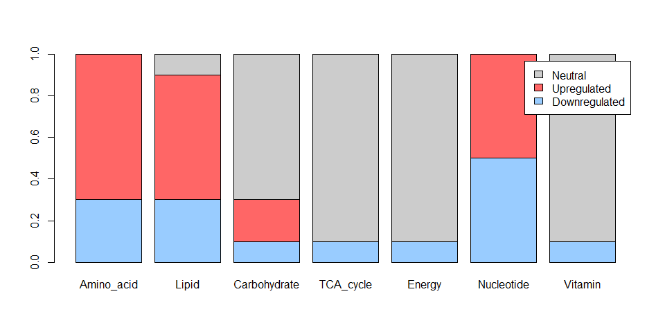
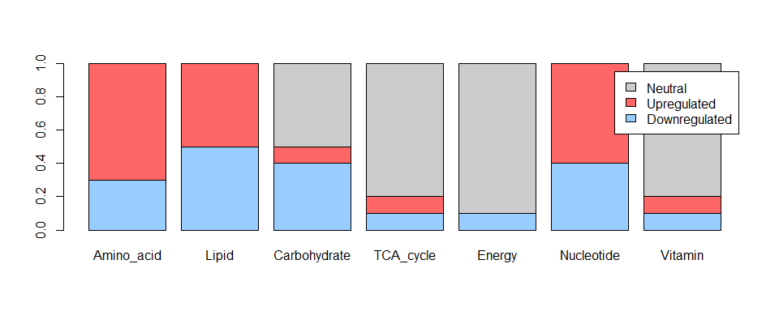

<!-- README.md is generated from README.Rmd. Please edit that file -->

# PureMeta </a>

<!-- badges: start -->
<!-- badges: end -->

## Overview

The goal of **PureMeta** is to provide functionality for extracting
tumor cells-based gene expression profiles (GEP) from bulk RNA-seq or
microarray data, and generating tumor cells-based metabolic phenotype
(i.e. downregulated, neutral, upregulated) for seven metabolic pathways.

## Installation

You can install the development version of PureMeta from
[GitHub](https://github.com/) with:

``` r
# install.packages("devtools")
devtools::install_github("WangKang-Leo/PureMeta")
```

## Example

**This is a basic example which shows you how to run PureMeta:**

**Step1**: Extracting tumor cell GEP from bulk RNA-seq/microarray data,
where you also need tumor adjacent normal tissue GEP as control. The
bulk tumor and normal GEP should be generated from the same experiments
(no significant batch effect existed there). Make sure GEP data is in
normal (not log) space. This example used 30 tumor and 5 non-cancerous
breast tissue (normal) GEP from
[GSE87455](https://www.ncbi.nlm.nih.gov/geo/query/acc.cgi?acc=GSE87455).

``` r
library(PureMeta)
## Only run 10 samples, this example would take ~10min
TC_GEP=Extract_TC_GEP(tumor[,1:10],normal) 
```

**The results included inferred tumor purity(0-1) as well as tumor cell
GEP.**

**To show distribution of purity.**

``` r
hist(TC_GEP$purity,xlab = 'tumor purity', main = 'Distribution of purity derived from PureMeta')
```



**Step2**: Generating metabolic phenotype using tumor cell GEP derived
from step1, or using tumor bulk GEP.

**For bulk GEP**

``` r
# run MetaPhenotype for 10 samples, p cut-off value was set as 0.1
Bulk_phenotype=MetaPhenotype(tumor[,1:10],0.1)
#> preparing geneSet collections...
#> GSEA analysis...
#> leading edge analysis...
#> done...
#> preparing geneSet collections...
#> GSEA analysis...
#> leading edge analysis...
#> done...
#> preparing geneSet collections...
#> GSEA analysis...
#> leading edge analysis...
#> done...
#> preparing geneSet collections...
#> GSEA analysis...
#> leading edge analysis...
#> done...
#> preparing geneSet collections...
#> GSEA analysis...
#> leading edge analysis...
#> done...
#> preparing geneSet collections...
#> GSEA analysis...
#> leading edge analysis...
#> done...
#> preparing geneSet collections...
#> GSEA analysis...
#> leading edge analysis...
#> done...
#> preparing geneSet collections...
#> GSEA analysis...
#> leading edge analysis...
#> done...
#> preparing geneSet collections...
#> GSEA analysis...
#> leading edge analysis...
#> done...
#> preparing geneSet collections...
#> GSEA analysis...
#> leading edge analysis...
#> done...
```

**Calculate and show proportion of metabolic phenotype for seven
pathway**

``` r
library(ggpubr);library(tidyverse)
phenotype=Bulk_phenotype$Metabolite_phenotype
data=phenotype[,2:8]
proportion_matrix <-data%>%
  pivot_longer(cols = everything()) %>%
  group_by(name, value) %>%
  summarize(percentage = n() / nrow(data)) %>%
  pivot_wider(names_from = value, values_from = percentage, values_fill = 0)
meta_name=proportion_matrix$name
proportion_matrix$name=NULL
proportion_matrix=t(proportion_matrix)
colnames(proportion_matrix)=meta_name
barplot(proportion_matrix, legend.text=T,
        names.arg=c("Amino_acid","Lipid","Carbohydrate","TCA_cycle","Energy","Nucleotide","Vitamin"),
        col =c("#99CCFF","#FF6666","#CCCCCC"))
```



**For Tumor cell GEP**

``` r
TC_phenotype=MetaPhenotype(TC_GEP$tumor_cell_GEP,0.1)
#> preparing geneSet collections...
#> GSEA analysis...
#> leading edge analysis...
#> done...
#> preparing geneSet collections...
#> GSEA analysis...
#> leading edge analysis...
#> done...
#> preparing geneSet collections...
#> GSEA analysis...
#> leading edge analysis...
#> done...
#> preparing geneSet collections...
#> GSEA analysis...
#> leading edge analysis...
#> done...
#> preparing geneSet collections...
#> GSEA analysis...
#> leading edge analysis...
#> done...
#> preparing geneSet collections...
#> GSEA analysis...
#> leading edge analysis...
#> done...
#> preparing geneSet collections...
#> GSEA analysis...
#> leading edge analysis...
#> done...
#> preparing geneSet collections...
#> GSEA analysis...
#> leading edge analysis...
#> done...
#> preparing geneSet collections...
#> GSEA analysis...
#> leading edge analysis...
#> done...
#> preparing geneSet collections...
#> GSEA analysis...
#> leading edge analysis...
#> done...
```

**Calculate and show proportion of metabolic phenotype for seven
pathway**

``` r
library(ggpubr);library(tidyverse)
phenotype=TC_phenotype$Metabolite_phenotype
data=phenotype[,2:8]
proportion_matrix <-data%>%
  pivot_longer(cols = everything()) %>%
  group_by(name, value) %>%
  summarize(percentage = n() / nrow(data)) %>%
  pivot_wider(names_from = value, values_from = percentage, values_fill = 0)
meta_name=proportion_matrix$name
proportion_matrix$name=NULL
proportion_matrix=t(proportion_matrix)
colnames(proportion_matrix)=meta_name
barplot(proportion_matrix, legend.text=T,
        names.arg=c("Amino_acid","Lipid","Carbohydrate","TCA_cycle","Energy","Nucleotide","Vitamin"),
        col =c("#99CCFF","#FF6666","#CCCCCC"))
```



## Citation

If PureMeta software is used in your publication, please cite the
following paper(s):

- Longitudinal molecular profiling elucidates immunometabolism dynamics
  in breast cancer. [Kang Wang et al.](https://www.nature.com/articles/s41467-024-47932-y) . (application of PureMeta to
  the longitudinal breast cancer cohort).
