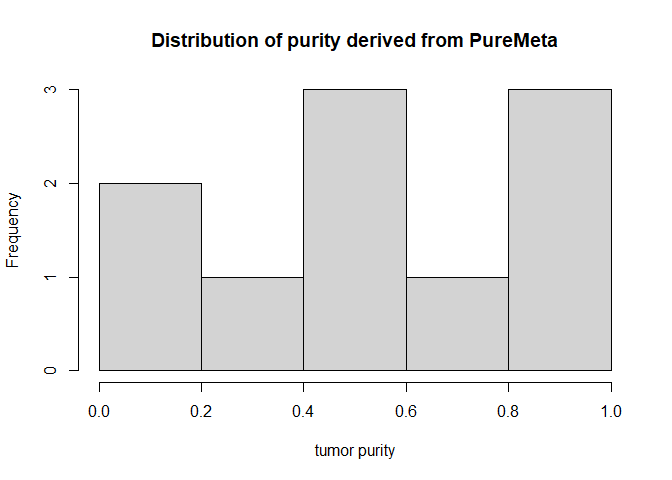
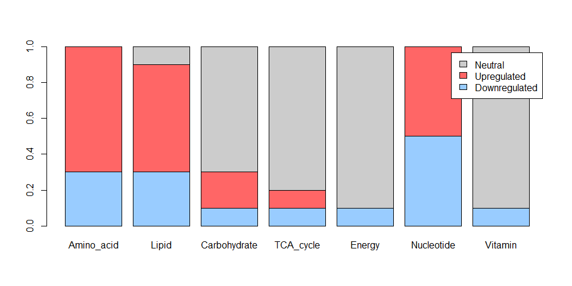

<!-- README.md is generated from README.Rmd. Please edit that file -->

# PureMeta </a>

<!-- badges: start -->
<!-- badges: end -->

## Overview

The goal of **PureMeta** is to provide functionality for extracting
tumor cells-based gene expression profiles from bulk RNA-seq or
microarray data, and generating tumor metabolic phenotype
(i.e. downregulated, neutral, upregulated) for seven metabolic pathways.

## Installation

You can install the development version of PureMeta from
[GitHub](https://github.com/) with:

``` r
# install.packages("devtools")
devtools::install_github("WangKang-Leo/PureMeta")
```

## Example

This is a basic example which shows you how to run PureMeta:

Step1: Extracting tumor cell GEP from bulk RNA-seq/microarray data,
where you also need tumor adjacent tissue GEP as control. The bulk tumor
and normal GEP come from the sample experiments (no significant batch
effect existed). Make sure GEP data is in normal (not log) space. This
example used 30 tumor and 5 non-cancerous breast tissue (normal) GEP
from
[GSE87455](https://www.ncbi.nlm.nih.gov/geo/query/acc.cgi?acc=GSE87455).

    #> INFO [2024-01-18 11:44:32] Initializing model...
    #> INFO [2024-01-18 11:44:32] MIN_KAPPA set to 106575.525430137
    #> INFO [2024-01-18 11:44:32] Running ISOpure step 1: CPE - Cancer Profile Estimation Step
    #> INFO [2024-01-18 11:44:32] --- optimizing mm...
    #> INFO [2024-01-18 11:44:42] --- optimizing theta...
    #> INFO [2024-01-18 11:44:58] --- optimizing vv...
    #> INFO [2024-01-18 11:44:58] --- optimizing kappa...
    #> INFO [2024-01-18 11:44:59] --- optimizing omega...
    #> INFO [2024-01-18 11:45:00] Total log likelihood: -687123825.229228
    #> INFO [2024-01-18 11:45:00] iter: 1/35, loglikelihood: -687123825.229228,
    #> INFO [2024-01-18 11:45:00]        change: Inf
    #> INFO [2024-01-18 11:45:00] --- optimizing mm...
    #> INFO [2024-01-18 11:45:08] --- optimizing theta...
    #> INFO [2024-01-18 11:45:22] --- optimizing vv...
    #> INFO [2024-01-18 11:45:22] --- optimizing kappa...
    #> INFO [2024-01-18 11:45:22] --- optimizing omega...
    #> INFO [2024-01-18 11:45:22] Total log likelihood: -686997888.347613
    #> INFO [2024-01-18 11:45:22] iter: 2/35, loglikelihood: -686997888.347613,
    #> INFO [2024-01-18 11:45:22]        change: 0.000183314801619416
    #> INFO [2024-01-18 11:45:22] --- optimizing mm...
    #> INFO [2024-01-18 11:45:31] --- optimizing theta...
    #> INFO [2024-01-18 11:45:44] --- optimizing vv...
    #> INFO [2024-01-18 11:45:44] --- optimizing kappa...
    #> INFO [2024-01-18 11:45:44] --- optimizing omega...
    #> INFO [2024-01-18 11:45:44] Total log likelihood: -686990151.671464
    #> INFO [2024-01-18 11:45:44] iter: 3/35, loglikelihood: -686990151.671464,
    #> INFO [2024-01-18 11:45:44]        change: 1.12616987737444e-05
    #> INFO [2024-01-18 11:45:44] --- optimizing mm...
    #> INFO [2024-01-18 11:45:51] --- optimizing theta...
    #> INFO [2024-01-18 11:46:04] --- optimizing vv...
    #> INFO [2024-01-18 11:46:04] --- optimizing kappa...
    #> INFO [2024-01-18 11:46:04] --- optimizing omega...
    #> INFO [2024-01-18 11:46:05] Total log likelihood: -686988449.088694
    #> INFO [2024-01-18 11:46:05] iter: 4/35, loglikelihood: -686988449.088694,
    #> INFO [2024-01-18 11:46:05]        change: 2.47832808974261e-06
    #> INFO [2024-01-18 11:46:05] --- optimizing mm...
    #> INFO [2024-01-18 11:46:11] --- optimizing theta...
    #> INFO [2024-01-18 11:46:24] --- optimizing vv...
    #> INFO [2024-01-18 11:46:24] --- optimizing kappa...
    #> INFO [2024-01-18 11:46:24] --- optimizing omega...
    #> INFO [2024-01-18 11:46:24] Total log likelihood: -686987736.949469
    #> INFO [2024-01-18 11:46:24] iter: 5/35, loglikelihood: -686987736.949469,
    #> INFO [2024-01-18 11:46:24]        change: 1.03661126152075e-06
    #> INFO [2024-01-18 11:46:24] --- optimizing mm...
    #> INFO [2024-01-18 11:46:34] --- optimizing theta...
    #> INFO [2024-01-18 11:46:45] --- optimizing vv...
    #> INFO [2024-01-18 11:46:45] --- optimizing kappa...
    #> INFO [2024-01-18 11:46:45] --- optimizing omega...
    #> INFO [2024-01-18 11:46:46] Total log likelihood: -686987273.275837
    #> INFO [2024-01-18 11:46:46] iter: 6/35, loglikelihood: -686987273.275837,
    #> INFO [2024-01-18 11:46:46]        change: 6.74937732010583e-07
    #> INFO [2024-01-18 11:46:46] --- optimizing mm...
    #> INFO [2024-01-18 11:46:53] --- optimizing theta...
    #> INFO [2024-01-18 11:47:05] --- optimizing vv...
    #> INFO [2024-01-18 11:47:05] --- optimizing kappa...
    #> INFO [2024-01-18 11:47:05] --- optimizing omega...
    #> INFO [2024-01-18 11:47:05] Total log likelihood: -686986973.721147
    #> INFO [2024-01-18 11:47:05] iter: 7/35, loglikelihood: -686986973.721147,
    #> INFO [2024-01-18 11:47:05]        change: 4.36041295486028e-07
    #> INFO [2024-01-18 11:47:05] --- optimizing mm...
    #> INFO [2024-01-18 11:47:14] --- optimizing theta...
    #> INFO [2024-01-18 11:47:29] --- optimizing vv...
    #> INFO [2024-01-18 11:47:29] --- optimizing kappa...
    #> INFO [2024-01-18 11:47:29] --- optimizing omega...
    #> INFO [2024-01-18 11:47:29] Total log likelihood: -686986740.996332
    #> INFO [2024-01-18 11:47:29] iter: 8/35, loglikelihood: -686986740.996332,
    #> INFO [2024-01-18 11:47:29]        change: 3.38761727124887e-07
    #> INFO [2024-01-18 11:47:29] --- optimizing mm...
    #> INFO [2024-01-18 11:47:38] --- optimizing theta...
    #> INFO [2024-01-18 11:47:53] --- optimizing vv...
    #> INFO [2024-01-18 11:47:53] --- optimizing kappa...
    #> INFO [2024-01-18 11:47:53] --- optimizing omega...
    #> INFO [2024-01-18 11:47:53] Total log likelihood: -686986549.073254
    #> INFO [2024-01-18 11:47:53] iter: 9/35, loglikelihood: -686986549.073254,
    #> INFO [2024-01-18 11:47:53]        change: 2.79369484307728e-07
    #> INFO [2024-01-18 11:47:53] --- optimizing mm...
    #> INFO [2024-01-18 11:48:00] --- optimizing theta...
    #> INFO [2024-01-18 11:48:15] --- optimizing vv...
    #> INFO [2024-01-18 11:48:15] --- optimizing kappa...
    #> INFO [2024-01-18 11:48:15] --- optimizing omega...
    #> INFO [2024-01-18 11:48:16] Total log likelihood: -686986393.512702
    #> INFO [2024-01-18 11:48:16] iter: 10/35, loglikelihood: -686986393.512702,
    #> INFO [2024-01-18 11:48:16]        change: 2.26439057763515e-07
    #> INFO [2024-01-18 11:48:16] --- optimizing mm...
    #> INFO [2024-01-18 11:48:23] --- optimizing theta...
    #> INFO [2024-01-18 11:48:40] --- optimizing vv...
    #> INFO [2024-01-18 11:48:40] --- optimizing kappa...
    #> INFO [2024-01-18 11:48:40] --- optimizing omega...
    #> INFO [2024-01-18 11:48:40] Total log likelihood: -686986272.277586
    #> INFO [2024-01-18 11:48:40] iter: 11/35, loglikelihood: -686986272.277586,
    #> INFO [2024-01-18 11:48:40]        change: 1.76473855991105e-07
    #> INFO [2024-01-18 11:48:40] --- optimizing mm...
    #> INFO [2024-01-18 11:48:46] --- optimizing theta...
    #> INFO [2024-01-18 11:49:01] --- optimizing vv...
    #> INFO [2024-01-18 11:49:01] --- optimizing kappa...
    #> INFO [2024-01-18 11:49:02] --- optimizing omega...
    #> INFO [2024-01-18 11:49:02] Total log likelihood: -686986166.495336
    #> INFO [2024-01-18 11:49:02] iter: 12/35, loglikelihood: -686986166.495336,
    #> INFO [2024-01-18 11:49:02]        change: 1.53980174691391e-07
    #> INFO [2024-01-18 11:49:02] --- optimizing mm...
    #> INFO [2024-01-18 11:49:09] --- optimizing theta...
    #> INFO [2024-01-18 11:49:22] --- optimizing vv...
    #> INFO [2024-01-18 11:49:22] --- optimizing kappa...
    #> INFO [2024-01-18 11:49:22] --- optimizing omega...
    #> INFO [2024-01-18 11:49:22] Total log likelihood: -686986060.684626
    #> INFO [2024-01-18 11:49:22] iter: 13/35, loglikelihood: -686986060.684626,
    #> INFO [2024-01-18 11:49:22]        change: 1.5402162595129e-07
    #> INFO [2024-01-18 11:49:22] --- optimizing mm...
    #> INFO [2024-01-18 11:49:30] --- optimizing theta...
    #> INFO [2024-01-18 11:49:42] --- optimizing vv...
    #> INFO [2024-01-18 11:49:42] --- optimizing kappa...
    #> INFO [2024-01-18 11:49:42] --- optimizing omega...
    #> INFO [2024-01-18 11:49:43] Total log likelihood: -686985964.662866
    #> INFO [2024-01-18 11:49:43] iter: 14/35, loglikelihood: -686985964.662866,
    #> INFO [2024-01-18 11:49:43]        change: 1.3977252125031e-07
    #> INFO [2024-01-18 11:49:43] --- optimizing mm...
    #> INFO [2024-01-18 11:49:50] --- optimizing theta...
    #> INFO [2024-01-18 11:50:03] --- optimizing vv...
    #> INFO [2024-01-18 11:50:03] --- optimizing kappa...
    #> INFO [2024-01-18 11:50:03] --- optimizing omega...
    #> INFO [2024-01-18 11:50:03] Total log likelihood: -686985862.768777
    #> INFO [2024-01-18 11:50:03] iter: 15/35, loglikelihood: -686985862.768777,
    #> INFO [2024-01-18 11:50:03]        change: 1.48320502169294e-07
    #> INFO [2024-01-18 11:50:03] --- optimizing mm...
    #> INFO [2024-01-18 11:50:09] --- optimizing theta...
    #> INFO [2024-01-18 11:50:22] --- optimizing vv...
    #> INFO [2024-01-18 11:50:22] --- optimizing kappa...
    #> INFO [2024-01-18 11:50:22] --- optimizing omega...
    #> INFO [2024-01-18 11:50:22] Total log likelihood: -686985777.263958
    #> INFO [2024-01-18 11:50:22] iter: 16/35, loglikelihood: -686985777.263958,
    #> INFO [2024-01-18 11:50:22]        change: 1.24463740158474e-07
    #> INFO [2024-01-18 11:50:22] --- optimizing mm...
    #> INFO [2024-01-18 11:50:28] --- optimizing theta...
    #> INFO [2024-01-18 11:50:42] --- optimizing vv...
    #> INFO [2024-01-18 11:50:42] --- optimizing kappa...
    #> INFO [2024-01-18 11:50:42] --- optimizing omega...
    #> INFO [2024-01-18 11:50:43] Total log likelihood: -686985693.447639
    #> INFO [2024-01-18 11:50:43] iter: 17/35, loglikelihood: -686985693.447639,
    #> INFO [2024-01-18 11:50:43]        change: 1.22005916783791e-07
    #> INFO [2024-01-18 11:50:43] --- optimizing mm...
    #> INFO [2024-01-18 11:50:50] --- optimizing theta...
    #> INFO [2024-01-18 11:51:03] --- optimizing vv...
    #> INFO [2024-01-18 11:51:03] --- optimizing kappa...
    #> INFO [2024-01-18 11:51:03] --- optimizing omega...
    #> INFO [2024-01-18 11:51:04] Total log likelihood: -686985607.090655
    #> INFO [2024-01-18 11:51:04] iter: 18/35, loglikelihood: -686985607.090655,
    #> INFO [2024-01-18 11:51:04]        change: 1.25704210759464e-07
    #> INFO [2024-01-18 11:51:04] --- optimizing mm...
    #> INFO [2024-01-18 11:51:09] --- optimizing theta...
    #> INFO [2024-01-18 11:51:22] --- optimizing vv...
    #> INFO [2024-01-18 11:51:22] --- optimizing kappa...
    #> INFO [2024-01-18 11:51:23] --- optimizing omega...
    #> INFO [2024-01-18 11:51:23] Total log likelihood: -686985527.840352
    #> INFO [2024-01-18 11:51:23] iter: 19/35, loglikelihood: -686985527.840352,
    #> INFO [2024-01-18 11:51:23]        change: 1.15359494916854e-07
    #> INFO [2024-01-18 11:51:23] --- optimizing mm...
    #> INFO [2024-01-18 11:51:30] --- optimizing theta...
    #> INFO [2024-01-18 11:51:46] --- optimizing vv...
    #> INFO [2024-01-18 11:51:46] --- optimizing kappa...
    #> INFO [2024-01-18 11:51:47] --- optimizing omega...
    #> INFO [2024-01-18 11:51:47] Total log likelihood: -686985417.844638
    #> INFO [2024-01-18 11:51:47] iter: 20/35, loglikelihood: -686985417.844638,
    #> INFO [2024-01-18 11:51:47]        change: 1.60113607212013e-07
    #> INFO [2024-01-18 11:51:47] --- optimizing mm...
    #> INFO [2024-01-18 11:51:55] --- optimizing theta...
    #> INFO [2024-01-18 11:52:09] --- optimizing vv...
    #> INFO [2024-01-18 11:52:09] --- optimizing kappa...
    #> INFO [2024-01-18 11:52:09] --- optimizing omega...
    #> INFO [2024-01-18 11:52:09] Total log likelihood: -686985316.058497
    #> INFO [2024-01-18 11:52:09] iter: 21/35, loglikelihood: -686985316.058497,
    #> INFO [2024-01-18 11:52:09]        change: 1.48163489284989e-07
    #> INFO [2024-01-18 11:52:09] --- optimizing mm...
    #> INFO [2024-01-18 11:52:17] --- optimizing theta...
    #> INFO [2024-01-18 11:52:30] --- optimizing vv...
    #> INFO [2024-01-18 11:52:30] --- optimizing kappa...
    #> INFO [2024-01-18 11:52:31] --- optimizing omega...
    #> INFO [2024-01-18 11:52:31] Total log likelihood: -686985157.201775
    #> INFO [2024-01-18 11:52:31] iter: 22/35, loglikelihood: -686985157.201775,
    #> INFO [2024-01-18 11:52:31]        change: 2.31237488278108e-07
    #> INFO [2024-01-18 11:52:31] --- optimizing mm...
    #> INFO [2024-01-18 11:52:38] --- optimizing theta...
    #> INFO [2024-01-18 11:52:50] --- optimizing vv...
    #> INFO [2024-01-18 11:52:50] --- optimizing kappa...
    #> INFO [2024-01-18 11:52:51] --- optimizing omega...
    #> INFO [2024-01-18 11:52:51] Total log likelihood: -686985022.937823
    #> INFO [2024-01-18 11:52:51] iter: 23/35, loglikelihood: -686985022.937823,
    #> INFO [2024-01-18 11:52:51]        change: 1.95439415790794e-07
    #> INFO [2024-01-18 11:52:51] --- optimizing mm...
    #> INFO [2024-01-18 11:52:57] --- optimizing theta...
    #> INFO [2024-01-18 11:53:11] --- optimizing vv...
    #> INFO [2024-01-18 11:53:11] --- optimizing kappa...
    #> INFO [2024-01-18 11:53:11] --- optimizing omega...
    #> INFO [2024-01-18 11:53:11] Total log likelihood: -686984907.630318
    #> INFO [2024-01-18 11:53:11] iter: 24/35, loglikelihood: -686984907.630318,
    #> INFO [2024-01-18 11:53:11]        change: 1.67845762095309e-07
    #> INFO [2024-01-18 11:53:11] --- optimizing mm...
    #> INFO [2024-01-18 11:53:18] --- optimizing theta...
    #> INFO [2024-01-18 11:53:33] --- optimizing vv...
    #> INFO [2024-01-18 11:53:33] --- optimizing kappa...
    #> INFO [2024-01-18 11:53:34] --- optimizing omega...
    #> INFO [2024-01-18 11:53:34] Total log likelihood: -686984817.849425
    #> INFO [2024-01-18 11:53:34] iter: 25/35, loglikelihood: -686984817.849425,
    #> INFO [2024-01-18 11:53:34]        change: 1.30688321484038e-07
    #> INFO [2024-01-18 11:53:34] --- optimizing mm...
    #> INFO [2024-01-18 11:53:42] --- optimizing theta...
    #> INFO [2024-01-18 11:53:56] --- optimizing vv...
    #> INFO [2024-01-18 11:53:56] --- optimizing kappa...
    #> INFO [2024-01-18 11:53:56] --- optimizing omega...
    #> INFO [2024-01-18 11:53:56] Total log likelihood: -686984732.371119
    #> INFO [2024-01-18 11:53:56] iter: 26/35, loglikelihood: -686984732.371119,
    #> INFO [2024-01-18 11:53:56]        change: 1.2442533551164e-07
    #> INFO [2024-01-18 11:53:56] --- optimizing mm...
    #> INFO [2024-01-18 11:54:03] --- optimizing theta...
    #> INFO [2024-01-18 11:54:16] --- optimizing vv...
    #> INFO [2024-01-18 11:54:16] --- optimizing kappa...
    #> INFO [2024-01-18 11:54:17] --- optimizing omega...
    #> INFO [2024-01-18 11:54:17] Total log likelihood: -686984659.471401
    #> INFO [2024-01-18 11:54:17] iter: 27/35, loglikelihood: -686984659.471401,
    #> INFO [2024-01-18 11:54:17]        change: 1.06115496062272e-07
    #> INFO [2024-01-18 11:54:17] --- optimizing mm...
    #> INFO [2024-01-18 11:54:24] --- optimizing theta...
    #> INFO [2024-01-18 11:54:35] --- optimizing vv...
    #> INFO [2024-01-18 11:54:35] --- optimizing kappa...
    #> INFO [2024-01-18 11:54:35] --- optimizing omega...
    #> INFO [2024-01-18 11:54:36] Total log likelihood: -686984589.072072
    #> INFO [2024-01-18 11:54:36] iter: 28/35, loglikelihood: -686984589.072072,
    #> INFO [2024-01-18 11:54:36]        change: 1.02475848901003e-07
    #> INFO [2024-01-18 11:54:36] --- optimizing mm...
    #> INFO [2024-01-18 11:54:42] --- optimizing theta...
    #> INFO [2024-01-18 11:54:54] --- optimizing vv...
    #> INFO [2024-01-18 11:54:54] --- optimizing kappa...
    #> INFO [2024-01-18 11:54:54] --- optimizing omega...
    #> INFO [2024-01-18 11:54:54] Total log likelihood: -686984525.047122
    #> INFO [2024-01-18 11:54:54] iter: 29/35, loglikelihood: -686984525.047122,
    #> INFO [2024-01-18 11:54:54]        change: 9.31970783754127e-08
    #> INFO [2024-01-18 11:54:54] --- optimizing mm...
    #> INFO [2024-01-18 11:55:01] --- optimizing theta...
    #> INFO [2024-01-18 11:55:14] --- optimizing vv...
    #> INFO [2024-01-18 11:55:14] --- optimizing kappa...
    #> INFO [2024-01-18 11:55:14] --- optimizing omega...
    #> INFO [2024-01-18 11:55:14] Total log likelihood: -686984459.132887
    #> INFO [2024-01-18 11:55:14] iter: 30/35, loglikelihood: -686984459.132887,
    #> INFO [2024-01-18 11:55:14]        change: 9.59471993876394e-08
    #> INFO [2024-01-18 11:55:14] --- optimizing mm...
    #> INFO [2024-01-18 11:55:21] --- optimizing theta...
    #> INFO [2024-01-18 11:55:35] --- optimizing vv...
    #> INFO [2024-01-18 11:55:35] --- optimizing kappa...
    #> INFO [2024-01-18 11:55:35] --- optimizing omega...
    #> INFO [2024-01-18 11:55:36] Total log likelihood: -686984399.284634
    #> INFO [2024-01-18 11:55:36] iter: 31/35, loglikelihood: -686984399.284634,
    #> INFO [2024-01-18 11:55:36]        change: 8.71173391343602e-08
    #> INFO [2024-01-18 11:55:36] --- optimizing mm...
    #> INFO [2024-01-18 11:55:44] --- optimizing theta...
    #> INFO [2024-01-18 11:55:59] --- optimizing vv...
    #> INFO [2024-01-18 11:55:59] --- optimizing kappa...
    #> INFO [2024-01-18 11:56:00] --- optimizing omega...
    #> INFO [2024-01-18 11:56:00] Total log likelihood: -686984314.372035
    #> INFO [2024-01-18 11:56:00] iter: 32/35, loglikelihood: -686984314.372035,
    #> INFO [2024-01-18 11:56:00]        change: 1.23601947569339e-07
    #> INFO [2024-01-18 11:56:00] --- optimizing mm...
    #> INFO [2024-01-18 11:56:08] --- optimizing theta...
    #> INFO [2024-01-18 11:56:22] --- optimizing vv...
    #> INFO [2024-01-18 11:56:22] --- optimizing kappa...
    #> INFO [2024-01-18 11:56:23] --- optimizing omega...
    #> INFO [2024-01-18 11:56:23] Total log likelihood: -686984235.654712
    #> INFO [2024-01-18 11:56:23] iter: 33/35, loglikelihood: -686984235.654712,
    #> INFO [2024-01-18 11:56:23]        change: 1.14583885769946e-07
    #> INFO [2024-01-18 11:56:23] --- optimizing mm...
    #> INFO [2024-01-18 11:56:32] --- optimizing theta...
    #> INFO [2024-01-18 11:56:44] --- optimizing vv...
    #> INFO [2024-01-18 11:56:44] --- optimizing kappa...
    #> INFO [2024-01-18 11:56:44] --- optimizing omega...
    #> INFO [2024-01-18 11:56:45] Total log likelihood: -686984147.862101
    #> INFO [2024-01-18 11:56:45] iter: 34/35, loglikelihood: -686984147.862101,
    #> INFO [2024-01-18 11:56:45]        change: 1.27794230650744e-07
    #> INFO [2024-01-18 11:56:45] --- optimizing mm...
    #> INFO [2024-01-18 11:56:51] --- optimizing theta...
    #> INFO [2024-01-18 11:57:05] --- optimizing vv...
    #> INFO [2024-01-18 11:57:05] --- optimizing kappa...
    #> INFO [2024-01-18 11:57:06] --- optimizing omega...
    #> INFO [2024-01-18 11:57:06] Total log likelihood: -686984082.850915
    #> INFO [2024-01-18 11:57:06] iter: 35/35, loglikelihood: -686984082.850915,
    #> INFO [2024-01-18 11:57:06]        change: 9.46327391706921e-08
    #> INFO [2024-01-18 11:57:06] Initializing model ...
    #> INFO [2024-01-18 11:57:06] MIN_KAPPA set to 481848.87427154
    #> INFO [2024-01-18 11:57:06] Running ISOpure step 2: PPE - Patient Profile Estimation Step
    #> INFO [2024-01-18 11:57:06] --- optimizing cc...
    #> INFO [2024-01-18 11:57:23] --- optimizing theta...
    #> INFO [2024-01-18 11:57:41] --- optimizing vv...
    #> INFO [2024-01-18 11:57:41] --- optimizing kappa...
    #> INFO [2024-01-18 11:57:44] Total log likelihood: -683378179.560607
    #> INFO [2024-01-18 11:57:44] iter: 1/35, loglikelihood: -683378179.560607,
    #> INFO [2024-01-18 11:57:44]        change: Inf
    #> INFO [2024-01-18 11:57:44] --- optimizing cc...
    #> INFO [2024-01-18 11:57:56] --- optimizing theta...
    #> INFO [2024-01-18 11:58:13] --- optimizing vv...
    #> INFO [2024-01-18 11:58:13] --- optimizing kappa...
    #> INFO [2024-01-18 11:58:17] Total log likelihood: -682584942.887104
    #> INFO [2024-01-18 11:58:17] iter: 2/35, loglikelihood: -682584942.887104,
    #> INFO [2024-01-18 11:58:17]        change: 0.00116210690225313
    #> INFO [2024-01-18 11:58:17] --- optimizing cc...
    #> INFO [2024-01-18 11:58:28] --- optimizing theta...
    #> INFO [2024-01-18 11:58:44] --- optimizing vv...
    #> INFO [2024-01-18 11:58:44] --- optimizing kappa...
    #> INFO [2024-01-18 11:58:46] Total log likelihood: -682525742.707832
    #> INFO [2024-01-18 11:58:46] iter: 3/35, loglikelihood: -682525742.707832,
    #> INFO [2024-01-18 11:58:46]        change: 8.6736917844224e-05
    #> INFO [2024-01-18 11:58:46] --- optimizing cc...
    #> INFO [2024-01-18 11:58:56] --- optimizing theta...
    #> INFO [2024-01-18 11:59:11] --- optimizing vv...
    #> INFO [2024-01-18 11:59:11] --- optimizing kappa...
    #> INFO [2024-01-18 11:59:13] Total log likelihood: -682520747.328458
    #> INFO [2024-01-18 11:59:13] iter: 4/35, loglikelihood: -682520747.328458,
    #> INFO [2024-01-18 11:59:13]        change: 7.31901468704226e-06
    #> INFO [2024-01-18 11:59:13] --- optimizing cc...
    #> INFO [2024-01-18 11:59:23] --- optimizing theta...
    #> INFO [2024-01-18 11:59:37] --- optimizing vv...
    #> INFO [2024-01-18 11:59:37] --- optimizing kappa...
    #> INFO [2024-01-18 11:59:39] Total log likelihood: -682519668.204383
    #> INFO [2024-01-18 11:59:39] iter: 5/35, loglikelihood: -682519668.204383,
    #> INFO [2024-01-18 11:59:39]        change: 1.58108861262939e-06
    #> INFO [2024-01-18 11:59:39] --- optimizing cc...
    #> INFO [2024-01-18 11:59:48] --- optimizing theta...
    #> INFO [2024-01-18 12:00:03] --- optimizing vv...
    #> INFO [2024-01-18 12:00:03] --- optimizing kappa...
    #> INFO [2024-01-18 12:00:05] Total log likelihood: -682519272.021961
    #> INFO [2024-01-18 12:00:05] iter: 6/35, loglikelihood: -682519272.021961,
    #> INFO [2024-01-18 12:00:05]        change: 5.80470672885953e-07
    #> INFO [2024-01-18 12:00:05] --- optimizing cc...
    #> INFO [2024-01-18 12:00:16] --- optimizing theta...
    #> INFO [2024-01-18 12:00:29] --- optimizing vv...
    #> INFO [2024-01-18 12:00:29] --- optimizing kappa...
    #> INFO [2024-01-18 12:00:31] Total log likelihood: -682519078.339117
    #> INFO [2024-01-18 12:00:31] iter: 7/35, loglikelihood: -682519078.339117,
    #> INFO [2024-01-18 12:00:31]        change: 2.83776455347378e-07
    #> INFO [2024-01-18 12:00:31] --- optimizing cc...
    #> INFO [2024-01-18 12:00:44] --- optimizing theta...
    #> INFO [2024-01-18 12:00:58] --- optimizing vv...
    #> INFO [2024-01-18 12:00:58] --- optimizing kappa...
    #> INFO [2024-01-18 12:01:00] Total log likelihood: -682518966.825743
    #> INFO [2024-01-18 12:01:00] iter: 8/35, loglikelihood: -682518966.825743,
    #> INFO [2024-01-18 12:01:00]        change: 1.63385017727455e-07
    #> INFO [2024-01-18 12:01:00] --- optimizing cc...
    #> INFO [2024-01-18 12:01:09] --- optimizing theta...
    #> INFO [2024-01-18 12:01:21] --- optimizing vv...
    #> INFO [2024-01-18 12:01:21] --- optimizing kappa...
    #> INFO [2024-01-18 12:01:23] Total log likelihood: -682518896.63328
    #> INFO [2024-01-18 12:01:23] iter: 9/35, loglikelihood: -682518896.63328,
    #> INFO [2024-01-18 12:01:23]        change: 1.02843252582478e-07
    #> INFO [2024-01-18 12:01:23] --- optimizing cc...
    #> INFO [2024-01-18 12:01:32] --- optimizing theta...
    #> INFO [2024-01-18 12:01:43] --- optimizing vv...
    #> INFO [2024-01-18 12:01:43] --- optimizing kappa...
    #> INFO [2024-01-18 12:01:45] Total log likelihood: -682518850.1689
    #> INFO [2024-01-18 12:01:45] iter: 10/35, loglikelihood: -682518850.1689,
    #> INFO [2024-01-18 12:01:45]        change: 6.80777967341534e-08
    #> INFO [2024-01-18 12:01:45] --- optimizing cc...
    #> INFO [2024-01-18 12:01:53] --- optimizing theta...
    #> INFO [2024-01-18 12:02:04] --- optimizing vv...
    #> INFO [2024-01-18 12:02:04] --- optimizing kappa...
    #> INFO [2024-01-18 12:02:06] Total log likelihood: -682518817.247195
    #> INFO [2024-01-18 12:02:06] iter: 11/35, loglikelihood: -682518817.247195,
    #> INFO [2024-01-18 12:02:06]        change: 4.8235600682111e-08
    #> INFO [2024-01-18 12:02:06] --- optimizing cc...
    #> INFO [2024-01-18 12:02:15] --- optimizing theta...
    #> INFO [2024-01-18 12:02:29] --- optimizing vv...
    #> INFO [2024-01-18 12:02:29] --- optimizing kappa...
    #> INFO [2024-01-18 12:02:32] Total log likelihood: -682518793.002429
    #> INFO [2024-01-18 12:02:32] iter: 12/35, loglikelihood: -682518793.002429,
    #> INFO [2024-01-18 12:02:32]        change: 3.55224885314575e-08
    #> INFO [2024-01-18 12:02:32] --- optimizing cc...
    #> INFO [2024-01-18 12:02:43] --- optimizing theta...
    #> INFO [2024-01-18 12:02:56] --- optimizing vv...
    #> INFO [2024-01-18 12:02:56] --- optimizing kappa...
    #> INFO [2024-01-18 12:02:58] Total log likelihood: -682518771.813418
    #> INFO [2024-01-18 12:02:58] iter: 13/35, loglikelihood: -682518771.813418,
    #> INFO [2024-01-18 12:02:58]        change: 3.1045317093188e-08
    #> INFO [2024-01-18 12:02:58] --- optimizing cc...
    #> INFO [2024-01-18 12:03:07] --- optimizing theta...
    #> INFO [2024-01-18 12:03:18] --- optimizing vv...
    #> INFO [2024-01-18 12:03:18] --- optimizing kappa...
    #> INFO [2024-01-18 12:03:20] Total log likelihood: -682518756.676536
    #> INFO [2024-01-18 12:03:20] iter: 14/35, loglikelihood: -682518756.676536,
    #> INFO [2024-01-18 12:03:20]        change: 2.21779717568591e-08
    #> INFO [2024-01-18 12:03:20] --- optimizing cc...
    #> INFO [2024-01-18 12:03:31] --- optimizing theta...
    #> INFO [2024-01-18 12:03:45] --- optimizing vv...
    #> INFO [2024-01-18 12:03:45] --- optimizing kappa...
    #> INFO [2024-01-18 12:03:47] Total log likelihood: -682518744.021875
    #> INFO [2024-01-18 12:03:47] iter: 15/35, loglikelihood: -682518744.021875,
    #> INFO [2024-01-18 12:03:47]        change: 1.85411180181988e-08
    #> INFO [2024-01-18 12:03:47] --- optimizing cc...
    #> INFO [2024-01-18 12:03:58] --- optimizing theta...
    #> INFO [2024-01-18 12:04:12] --- optimizing vv...
    #> INFO [2024-01-18 12:04:12] --- optimizing kappa...
    #> INFO [2024-01-18 12:04:14] Total log likelihood: -682518731.578916
    #> INFO [2024-01-18 12:04:14] iter: 16/35, loglikelihood: -682518731.578916,
    #> INFO [2024-01-18 12:04:14]        change: 1.82309423764341e-08
    #> INFO [2024-01-18 12:04:14] --- optimizing cc...
    #> INFO [2024-01-18 12:04:24] --- optimizing theta...
    #> INFO [2024-01-18 12:04:36] --- optimizing vv...
    #> INFO [2024-01-18 12:04:36] --- optimizing kappa...
    #> INFO [2024-01-18 12:04:38] Total log likelihood: -682518719.829831
    #> INFO [2024-01-18 12:04:38] iter: 17/35, loglikelihood: -682518719.829831,
    #> INFO [2024-01-18 12:04:38]        change: 1.72143041486297e-08
    #> INFO [2024-01-18 12:04:38] --- optimizing cc...
    #> INFO [2024-01-18 12:04:47] --- optimizing theta...
    #> INFO [2024-01-18 12:04:59] --- optimizing vv...
    #> INFO [2024-01-18 12:04:59] --- optimizing kappa...
    #> INFO [2024-01-18 12:05:02] Total log likelihood: -682518710.431149
    #> INFO [2024-01-18 12:05:02] iter: 18/35, loglikelihood: -682518710.431149,
    #> INFO [2024-01-18 12:05:02]        change: 1.37705847710711e-08
    #> INFO [2024-01-18 12:05:02] --- optimizing cc...
    #> INFO [2024-01-18 12:05:12] --- optimizing theta...
    #> INFO [2024-01-18 12:05:26] --- optimizing vv...
    #> INFO [2024-01-18 12:05:26] --- optimizing kappa...
    #> INFO [2024-01-18 12:05:28] Total log likelihood: -682518699.306253
    #> INFO [2024-01-18 12:05:28] iter: 19/35, loglikelihood: -682518699.306253,
    #> INFO [2024-01-18 12:05:28]        change: 1.62997668828408e-08
    #> INFO [2024-01-18 12:05:28] --- optimizing cc...
    #> INFO [2024-01-18 12:05:38] --- optimizing theta...
    #> INFO [2024-01-18 12:05:50] --- optimizing vv...
    #> INFO [2024-01-18 12:05:50] --- optimizing kappa...
    #> INFO [2024-01-18 12:05:52] Total log likelihood: -682518688.385074
    #> INFO [2024-01-18 12:05:52] iter: 20/35, loglikelihood: -682518688.385074,
    #> INFO [2024-01-18 12:05:52]        change: 1.6001289927513e-08
    #> INFO [2024-01-18 12:05:52] --- optimizing cc...
    #> INFO [2024-01-18 12:06:02] --- optimizing theta...
    #> INFO [2024-01-18 12:06:16] --- optimizing vv...
    #> INFO [2024-01-18 12:06:16] --- optimizing kappa...
    #> INFO [2024-01-18 12:06:18] Total log likelihood: -682518678.87725
    #> INFO [2024-01-18 12:06:18] iter: 21/35, loglikelihood: -682518678.87725,
    #> INFO [2024-01-18 12:06:18]        change: 1.39304968434859e-08
    #> INFO [2024-01-18 12:06:18] --- optimizing cc...
    #> INFO [2024-01-18 12:06:27] --- optimizing theta...
    #> INFO [2024-01-18 12:06:40] --- optimizing vv...
    #> INFO [2024-01-18 12:06:40] --- optimizing kappa...
    #> INFO [2024-01-18 12:06:42] Total log likelihood: -682518670.25215
    #> INFO [2024-01-18 12:06:42] iter: 22/35, loglikelihood: -682518670.25215,
    #> INFO [2024-01-18 12:06:42]        change: 1.26371629596295e-08
    #> INFO [2024-01-18 12:06:42] --- optimizing cc...
    #> INFO [2024-01-18 12:06:52] --- optimizing theta...
    #> INFO [2024-01-18 12:07:05] --- optimizing vv...
    #> INFO [2024-01-18 12:07:05] --- optimizing kappa...
    #> INFO [2024-01-18 12:07:07] Total log likelihood: -682518662.105376
    #> INFO [2024-01-18 12:07:07] iter: 23/35, loglikelihood: -682518662.105376,
    #> INFO [2024-01-18 12:07:07]        change: 1.19363392450863e-08
    #> INFO [2024-01-18 12:07:07] --- optimizing cc...
    #> INFO [2024-01-18 12:07:17] --- optimizing theta...
    #> INFO [2024-01-18 12:07:29] --- optimizing vv...
    #> INFO [2024-01-18 12:07:29] --- optimizing kappa...
    #> INFO [2024-01-18 12:07:32] Total log likelihood: -682518655.67256
    #> INFO [2024-01-18 12:07:32] iter: 24/35, loglikelihood: -682518655.67256,
    #> INFO [2024-01-18 12:07:32]        change: 9.42511314275924e-09
    #> INFO [2024-01-18 12:07:32] --- optimizing cc...
    #> INFO [2024-01-18 12:07:41] --- optimizing theta...
    #> INFO [2024-01-18 12:07:53] --- optimizing vv...
    #> INFO [2024-01-18 12:07:53] --- optimizing kappa...
    #> INFO [2024-01-18 12:07:55] Total log likelihood: -682518649.786158
    #> INFO [2024-01-18 12:07:55] iter: 25/35, loglikelihood: -682518649.786158,
    #> INFO [2024-01-18 12:07:55]        change: 8.62452952923782e-09
    #> INFO [2024-01-18 12:07:55] --- optimizing cc...
    #> INFO [2024-01-18 12:08:05] --- optimizing theta...
    #> INFO [2024-01-18 12:08:19] --- optimizing vv...
    #> INFO [2024-01-18 12:08:19] --- optimizing kappa...
    #> INFO [2024-01-18 12:08:22] Total log likelihood: -682518644.02266
    #> INFO [2024-01-18 12:08:22] iter: 26/35, loglikelihood: -682518644.02266,
    #> INFO [2024-01-18 12:08:22]        change: 8.44445495976106e-09
    #> INFO [2024-01-18 12:08:22] --- optimizing cc...
    #> INFO [2024-01-18 12:08:31] --- optimizing theta...
    #> INFO [2024-01-18 12:08:43] --- optimizing vv...
    #> INFO [2024-01-18 12:08:43] --- optimizing kappa...
    #> INFO [2024-01-18 12:08:46] Total log likelihood: -682518638.653852
    #> INFO [2024-01-18 12:08:46] iter: 27/35, loglikelihood: -682518638.653852,
    #> INFO [2024-01-18 12:08:46]        change: 7.86617074792342e-09
    #> INFO [2024-01-18 12:08:46] --- optimizing cc...
    #> INFO [2024-01-18 12:08:58] --- optimizing theta...
    #> INFO [2024-01-18 12:09:11] --- optimizing vv...
    #> INFO [2024-01-18 12:09:11] --- optimizing kappa...
    #> INFO [2024-01-18 12:09:14] Total log likelihood: -682518632.931627
    #> INFO [2024-01-18 12:09:14] iter: 28/35, loglikelihood: -682518632.931627,
    #> INFO [2024-01-18 12:09:14]        change: 8.38398331632707e-09
    #> INFO [2024-01-18 12:09:14] --- optimizing cc...
    #> INFO [2024-01-18 12:09:24] --- optimizing theta...
    #> INFO [2024-01-18 12:09:36] --- optimizing vv...
    #> INFO [2024-01-18 12:09:36] --- optimizing kappa...
    #> INFO [2024-01-18 12:09:38] Total log likelihood: -682518626.762029
    #> INFO [2024-01-18 12:09:38] iter: 29/35, loglikelihood: -682518626.762029,
    #> INFO [2024-01-18 12:09:38]        change: 9.03945764974705e-09
    #> INFO [2024-01-18 12:09:38] --- optimizing cc...
    #> INFO [2024-01-18 12:09:48] --- optimizing theta...
    #> INFO [2024-01-18 12:10:01] --- optimizing vv...
    #> INFO [2024-01-18 12:10:01] --- optimizing kappa...
    #> INFO [2024-01-18 12:10:04] Total log likelihood: -682518620.466836
    #> INFO [2024-01-18 12:10:04] iter: 30/35, loglikelihood: -682518620.466836,
    #> INFO [2024-01-18 12:10:04]        change: 9.22347342929946e-09
    #> INFO [2024-01-18 12:10:04] --- optimizing cc...
    #> INFO [2024-01-18 12:10:16] --- optimizing theta...
    #> INFO [2024-01-18 12:10:28] --- optimizing vv...
    #> INFO [2024-01-18 12:10:28] --- optimizing kappa...
    #> INFO [2024-01-18 12:10:30] Total log likelihood: -682518613.679635
    #> INFO [2024-01-18 12:10:30] iter: 31/35, loglikelihood: -682518613.679635,
    #> INFO [2024-01-18 12:10:30]        change: 9.94434588320074e-09
    #> INFO [2024-01-18 12:10:30] --- optimizing cc...
    #> INFO [2024-01-18 12:10:41] --- optimizing theta...
    #> INFO [2024-01-18 12:10:52] --- optimizing vv...
    #> INFO [2024-01-18 12:10:52] --- optimizing kappa...
    #> INFO [2024-01-18 12:10:54] Total log likelihood: -682518606.771319
    #> INFO [2024-01-18 12:10:54] iter: 32/35, loglikelihood: -682518606.771319,
    #> INFO [2024-01-18 12:10:54]        change: 1.01217991510823e-08
    #> INFO [2024-01-18 12:10:54] --- optimizing cc...
    #> INFO [2024-01-18 12:11:04] --- optimizing theta...
    #> INFO [2024-01-18 12:11:17] --- optimizing vv...
    #> INFO [2024-01-18 12:11:17] --- optimizing kappa...
    #> INFO [2024-01-18 12:11:20] Total log likelihood: -682518598.913922
    #> INFO [2024-01-18 12:11:20] iter: 33/35, loglikelihood: -682518598.913922,
    #> INFO [2024-01-18 12:11:20]        change: 1.15123554645151e-08
    #> INFO [2024-01-18 12:11:20] --- optimizing cc...
    #> INFO [2024-01-18 12:11:30] --- optimizing theta...
    #> INFO [2024-01-18 12:11:43] --- optimizing vv...
    #> INFO [2024-01-18 12:11:43] --- optimizing kappa...
    #> INFO [2024-01-18 12:11:45] Total log likelihood: -682518592.618282
    #> INFO [2024-01-18 12:11:45] iter: 34/35, loglikelihood: -682518592.618282,
    #> INFO [2024-01-18 12:11:45]        change: 9.2241293078776e-09
    #> INFO [2024-01-18 12:11:45] --- optimizing cc...
    #> INFO [2024-01-18 12:11:55] --- optimizing theta...
    #> INFO [2024-01-18 12:12:07] --- optimizing vv...
    #> INFO [2024-01-18 12:12:07] --- optimizing kappa...
    #> INFO [2024-01-18 12:12:10] Total log likelihood: -682518579.358885
    #> INFO [2024-01-18 12:12:10] iter: 35/35, loglikelihood: -682518579.358885,
    #> INFO [2024-01-18 12:12:10]        change: 1.94271590999497e-08

The results included inferred tumor purity(0-1) as well as tumor cell
GEP.

show distribution of purity.

``` r
library(ggpubr)
#> Warning: package 'ggpubr' was built under R version 4.2.3
#> Loading required package: ggplot2
#> Warning: package 'ggplot2' was built under R version 4.2.3
ggdensity(TC_GEP$purity,fill = "lightyellow",add = "mean", rug = TRUE)
#> Warning: `geom_vline()`: Ignoring `mapping` because `xintercept` was provided.
#> Warning: `geom_vline()`: Ignoring `data` because `xintercept` was provided.
```



Step2: Generating metabolic phenotype using tumor cell GEP derived from
step1, or using tumor bulk GEP.

For bulk GEP

    #> [1] "Finish 1 samples"
    #> [1] "Finish 2 samples"
    #> [1] "Finish 3 samples"
    #> [1] "Finish 4 samples"
    #> [1] "Finish 5 samples"
    #> [1] "Finish 6 samples"
    #> [1] "Finish 7 samples"
    #> [1] "Finish 8 samples"
    #> [1] "Finish 9 samples"
    #> [1] "Finish 10 samples"

Calculate and show proportion of metabolic phenotype for seven pathway

``` r
library(ggpubr);library(tidyverse)
#> Warning: package 'tidyverse' was built under R version 4.2.3
#> Warning: package 'tibble' was built under R version 4.2.3
#> Warning: package 'readr' was built under R version 4.2.3
#> Warning: package 'purrr' was built under R version 4.2.3
#> Warning: package 'dplyr' was built under R version 4.2.3
#> Warning: package 'stringr' was built under R version 4.2.2
#> Warning: package 'forcats' was built under R version 4.2.3
#> Warning: package 'lubridate' was built under R version 4.2.3
#> ── Attaching core tidyverse packages ──────────────────────── tidyverse 2.0.0 ──
#> ✔ dplyr     1.1.3     ✔ readr     2.1.4
#> ✔ forcats   1.0.0     ✔ stringr   1.5.0
#> ✔ lubridate 1.9.3     ✔ tibble    3.2.1
#> ✔ purrr     1.0.2     ✔ tidyr     1.3.0
#> ── Conflicts ────────────────────────────────────────── tidyverse_conflicts() ──
#> ✖ dplyr::filter() masks stats::filter()
#> ✖ dplyr::lag()    masks stats::lag()
#> ℹ Use the conflicted package (<http://conflicted.r-lib.org/>) to force all conflicts to become errors
phenotype=Bulk_phenotype$Metabolite_phenotype
data=phenotype[,2:8]
proportion_matrix <-data%>%
  pivot_longer(cols = everything()) %>%
  group_by(name, value) %>%
  summarize(percentage = n() / nrow(data)) %>%
  pivot_wider(names_from = value, values_from = percentage, values_fill = 0)
#> `summarise()` has grouped output by 'name'. You can override using the
#> `.groups` argument.
meta_name=proportion_matrix$name
proportion_matrix$name=NULL
proportion_matrix=t(proportion_matrix)
colnames(proportion_matrix)=meta_name
barplot(proportion_matrix, legend.text=T,
        names.arg=c("Amino_acid","Lipid","Carbohydrate","TCA_cycle","Energy","Nucleotide","Vitamin"),
        col =c("#99CCFF","#FF6666","#CCCCCC"))
```



For Tumor cell GEP

    #> [1] "Finish 1 samples"
    #> [1] "Finish 2 samples"
    #> [1] "Finish 3 samples"
    #> [1] "Finish 4 samples"
    #> [1] "Finish 5 samples"
    #> [1] "Finish 6 samples"
    #> [1] "Finish 7 samples"
    #> [1] "Finish 8 samples"
    #> [1] "Finish 9 samples"
    #> [1] "Finish 10 samples"

Calculate and show proportion of metabolic phenotype for seven pathway

``` r
library(ggpubr);library(tidyverse)
phenotype=TC_phenotype$Metabolite_phenotype
data=phenotype[,2:8]
proportion_matrix <-data%>%
  pivot_longer(cols = everything()) %>%
  group_by(name, value) %>%
  summarize(percentage = n() / nrow(data)) %>%
  pivot_wider(names_from = value, values_from = percentage, values_fill = 0)
#> `summarise()` has grouped output by 'name'. You can override using the
#> `.groups` argument.
meta_name=proportion_matrix$name
proportion_matrix$name=NULL
proportion_matrix=t(proportion_matrix)
colnames(proportion_matrix)=meta_name
barplot(proportion_matrix, legend.text=T,
        names.arg=c("Amino_acid","Lipid","Carbohydrate","TCA_cycle","Energy","Nucleotide","Vitamin"),
        col =c("#99CCFF","#FF6666","#CCCCCC"))
```


## Citation

If PureMeta software is used in your publication, please cite the
following paper(s):

- Longitudinal molecular profiling elucidates immunometabolism dynamics
  in breast cancer. [Kang Wang et al.]() . (application of PureMeta to
  the longitudinal breast cancer cohort).
